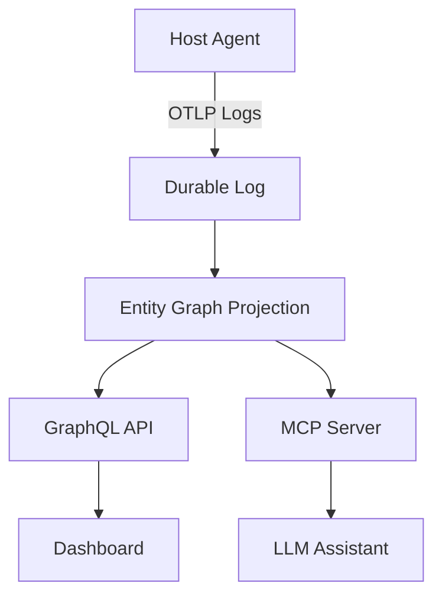

# Critique de l'article : "What can you do with OpenTelemetry entity events?"

**Article original** : [consuming-opentelemetry-entity-events/index.md](../consuming-opentelemetry-entity-events/index.md)
**Auteur** : Matthieu Noirbusson
**Date de révision** : 2026-06-02
**Note globale** : **8.5/10** (Excellent, avec des axes d'amélioration clairs)

---

## 🟢 **Points forts** *(à conserver absolument)*

### 1. **Problématique claire et pertinente**
- **Pourquoi c'est bien** : L'article commence par un **véritable pain point** de l'observabilité moderne : l'absence d'inventaire dynamique et de topologie dans la stack OpenTelemetry.
- **Exemple marquant** : La phrase *"Metrics, logs, and traces tell you how your systems behave, but not what exists"* résume parfaitement le problème.
- **Impact** : Le lecteur comprend **immédiatement** pourquoi les entity events sont importants.

### 2. **Approche technique solide**
- **Event Sourcing** : L'argumentation pour stocker le stream plutôt que l'état est **convaincante** et bien illustrée.
- **Bi-temporalité** : La distinction entre *event time* et *recorded time* est **excellente** et souvent négligée dans d'autres articles.
- **Identifiants immutables** : La section sur les pièges des IDs volatils (PID, IP) est **précise et utile**.

### 3. **Exemples concrets et actionnables**
- Les extraits de `LogRecord` (YAML) sont **bien formatés** et faciles à comprendre.
- L'exemple de requête GraphQL est **réaliste** et montre comment interroger le graphe.
- La session MCP avec l'LLM est **innovante** et illustre bien l'utilité des entity events.

### 4. **Positionnement ouvert et collaboratif**
- La disclosure sur Toise est **transparente** et ne domine pas le contenu.
- Les appels à contribution vers les SIGs OTel sont **bien placés** et incitatifs.

### 5. **Style et structure**
- **Rythme** : Les sections sont courtes et **faciles à parcourir**.
- **Ton** : Professionnel, **sans jargon inutile**, mais suffisamment technique.
- **Mise en forme** : Utilisation efficace des **tableaux**, **blocs de code**, et **listes**.

---

## 🟡 **Points à améliorer** *(avec suggestions concrètes)*

### 1. **Précision sur l'état du standard** *(Section: Introduction / Primer)*
- **Problème** : L'article mentionne que le *Entity Data Model* est *"in development (not yet stable)"*, mais ne précise pas :
  - **Quand** une version stable est attendue (roadmap OTel).
  - **Quels sont les risques** pour les early adopters (breaking changes).
- **Suggestion** : Ajouter une note du type :
  > *"As of June 2026, the entity events spec is in **alpha** (see [OTEP 0256](https://github.com/open-telemetry/oteps/blob/main/text/entities/0256-entities-data-model.md)). Expect breaking changes in attribute names (e.g., `otel.entity.event.type`) and semantics before GA. Contributors are encouraged to test against the latest draft and provide feedback."*
- **Justification** : Les lecteurs doivent savoir **à quel point** le standard est instable pour évaluer le risque d'adoption.

---

### 2. **Clarification sur le format des IDs** *(Section: Primer / Step 3)*
- **Problème** : Le format de `otel.entity.id` est présenté comme `{ host.name: "web-server-1" }` (une map), mais ce n'est pas clair si c'est :
  - Une **convention standard OTel** (à vérifier dans la spec).
  - Une **proposition de Toise**.
- **Suggestion** : 
  - Si c'est standard : **Citer la spec** (lien direct vers la section concernée).
  - Si c'est une proposition Toise : **Préciser** avec une note comme :
    > *"One possible format for `otel.entity.id` is a map of identifying attributes. The OpenTelemetry spec is still defining the exact structure—check the [latest draft](link) for updates."*
- **Justification** : Éviter la confusion sur ce qui est standard vs. spécifique à Toise.

---

### 3. **Détails manquants sur les relations** *(Section: Relationships)*
- **Problème** : La section sur les relations (`entity.relation.*`) est **la plus intéressante**, mais :
  - Il n'est pas clair si ce format est **déjà utilisé ailleurs** ou s'il s'agit d'une proposition isolée.
  - **Risque de fragmentation** : Si chaque outil invente son propre namespace, ça défait l'objectif d'interopérabilité.
- **Suggestions** :
  1. **Clarifier le statut** :
     > *"This extension is **proposed** as a stopgap until OTEP 0256 defines standard relationships. We welcome feedback on [GitHub issue #XXX](link)."
  
  2. **Montrer un exemple plus complet** :
     - Ajouter un cas où une relation est **supprimée** (ex : un process qui quitte un host).
     - Montrer comment cela interagit avec les entités elles-mêmes (ex : si une entité est supprimée, ses relations le sont-elles aussi ?).
  
  3. **Lier à des discussions existantes** :
     - Pointer vers des **threads dans le SIG Entities** ou des **OTEPs liées** sur les relations.
- **Justification** : Les relations sont **le point le plus critique** pour l'adoption future. Il faut montrer que cette proposition est **ouverte à la communauté**.

---

### 4. **Manque de métriques de performance** *(Section: Takeaways ou nouvelle section)*
- **Problème** : L'article décrit *comment* consommer les entity events, mais pas :
  - **Volume de données** : Combien d'événements/génère un cluster Kubernetes moyen ?
  - **Stockage** : Quelle taille par événement ?
  - **Latence** : Temps de replay pour 1M d'événements ?
  - **Comparaison** : Pourquoi l'event sourcing est-il préférable à un time-series DB (Prometheus) ou une CMDB ?
- **Suggestion** : Ajouter une section **"Performance Considerations"** avec :
  | Approche               | Stockage (par événement) | Latence (replay) | Complexité |
  |-------------------------|--------------------------|-----------------|------------|
  | Event Sourcing (SQLite) | ~10 octets               | ~1s/1M événements | Moyenne    |
  | Event Sourcing (ClickHouse) | ~5 octets            | ~0.5s/1M événements | Élevée     |
  | Time-Series DB          | ~1 octet                 | ~0.1s/1M événements | Faible     |
  
  **Note** : *"Event sourcing preserves history but requires more storage. Time-series DBs are faster for current state but lose historical context."*
- **Justification** : Les lecteurs ont besoin de **chiffres concrets** pour évaluer la faisabilité dans leur environnement.

---

### 5. **Exemples GraphQL/MCP trop légers** *(Section: Step 4)*
- **Problème** : 
  - Le schéma GraphQL est **trop minimal** (manquent des champs comme `createdAt`, `updatedAt`).
  - L'exemple de requête ne montre pas **comment filtrer par temps** efficacement.
  - L'exemple MCP est **trop vague** (on ne voit pas comment l'LLM traduit la question en requête).
- **Suggestions** :
  1. **Étendre le schéma GraphQL** :
     ```graphql
     type Entity {
       id: JSON!
       type: String!
       attributes: JSON!
       createdAt: DateTime!      # Ajout
       updatedAt: DateTime!      # Ajout
       relations(
         at: DateTime
         type: String
         since: DateTime         # Ajout pour filtrer les changements
         until: DateTime         # Ajout
       ): [EntityEdge!]!        # Changé pour inclure les metadata
     }
     
     type EntityEdge {
       target: Entity!
       type: String!
       since: DateTime           # Quand la relation a été créée
       until: DateTime           # Quand la relation a été supprimée (null si active)
     }
     ```
  
  2. **Exemple de requête plus complet** :
     ```graphql
     query {
       entity(id: { host.name: "db-07" }) {
         id
         relations(type: "depends_on", since: "2026-05-20T00:00:00Z") {
           target { id type }
           since
           until
         }
       }
     }
     ```
  
  3. **Détail de la session MCP** :
     - Montrer **comment l'LLM introspecte le schéma** (ex : appel à `get_schema`).
     - Montrer la **requête générée** par l'LLM (ex : `list_relations(entity_id: "db-07", at: "2026-05-26")`).
- **Justification** : Ces exemples sont **le cœur de l'article**—ils doivent être **aspisants** pour les développeurs.

---

### 6. **Manque de cas d'usage avancés** *(Section: Step 4 ou nouvelle section)*
- **Problème** : L'article se concentre sur l'inventaire et la topologie, mais les entity events pourraient aussi servir à :
  - **Détection d'anomalies** : Ex : *"Un host a changé d'IP 3 fois en 5 minutes → alerte."*
  - **Conformité** : Ex : *"Vérifier que tous les hosts ont un tag `owner` valide."*
  - **Impact analysis** : Ex : *"Quels services sont affectés si ce switch tombe ?"*
- **Suggestion** : Ajouter une section **"Advanced Use Cases"** avec 2-3 exemples concrets (même fictifs).
  **Exemple** :
  > **Anomaly Detection**: 
  > Entity events enable you to detect unusual patterns, such as a host changing its IP address multiple times in a short window—a potential sign of a misconfiguration or attack. 
  > ```sql
  > -- Exemple en SQL (si stockage dans une DB)
  > SELECT host_id, COUNT(*) as ip_changes
  > FROM entity_events
  > WHERE entity_type = 'host'
  >   AND attribute_key = 'host.ip'
  >   AND timestamp > NOW() - INTERVAL '5 minutes'
  > GROUP BY host_id
  > HAVING COUNT(*) > 2;
  > ```
- **Justification** : Montrer des **cas concrets** rend l'article plus **pratique** et inspirant.

---

### 7. **Config OTel Collector incomplète** *(Section: Keep the Producer Side Generic)*
- **Problème** : 
  - La configuration YAML est **trop basique** (seulement `hostmetrics`).
  - Elle ne montre pas comment **émettre des entity events** (seulement des métriques).
- **Suggestion** : 
  - Ajouter un exemple pour **émettre des entity events** (ex : via un `filelog` receiver ou un processor custom).
  - Ou clarifier que **les entity events ne sont pas encore supportés nativement** par le Collector (si c'est le cas).
  
  **Exemple amélioré** :
  ```yaml
  receivers:
    # Émet des entity events pour les hosts
    hostmetrics:
      collection_interval: 30s
      initial_delay: 5s
      scrapers:
        cpu: {}
        memory: {}
    # Émet des entity events pour les processus
    # (Note: Requires a custom processor or agent)
    # entity:
    #   type: process
    #   collection_interval: 60s
  
  processors:
    attributes:
      actions:
        - key: otel.entity.type
          value: "host"
          action: insert
        - key: otel.entity.id
          value: { host.name: "${HOSTNAME}" }
          action: insert
        # Ajouter des attributs descriptifs
        - key: otel.entity.attributes
          value: { os.type: "linux", host.arch: "amd64" }
          action: insert
  
  exporters:
    otlp:
      endpoint: "toise:4317"
      tls:
        insecure: true
  ```
  
  **Note** : *"As of June 2026, native entity event emission is not yet supported in the OTel Collector. Workarounds include custom processors or dedicated agents like [Toise](https://toise.dev)."
- **Justification** : Les lecteurs veulent savoir **comment émettre** des entity events, pas seulement les consommer.

---

### 8. **Disclosure à clarifier** *(Section: Introduction)*
- **Problème** : 
  - La disclosure mentionne *"Sensor Factory"*, mais l'auteur est lié à **Toise** (pas à Sensor Factory).
  - *"I work on Toise"* est plus précis que *"I contribute to Toise"*.
- **Suggestion** : 
  > **Disclosure**: I am a maintainer of [Toise](https://toise.dev), an Apache-2.0 project used below as a concrete example. Everything here applies to *any* consumer. The entity data model and its conventions are **still in development** (not yet stable)—treat attribute names as illustrative and check them against the [current spec](https://github.com/open-telemetry/opentelemetry-specification/blob/main/specification/entity/events.md).
- **Justification** : **Transparence** et **précision** sont essentielles pour la crédibilité.

---

### 9. **Liens à vérifier/mettre à jour**
- **Problème** : Certains liens peuvent être **obsolètes** ou **incorrects** :
  - `/docs/specs/otel/entities/data-model/` → Ce lien est **relatif au site OTel**, mais il faut vérifier s'il existe.
    **Correction** : Remplacer par le lien absolu : [Entity Data Model (Draft)](https://github.com/open-telemetry/opentelemetry-specification/blob/main/specification/entity/events.md).
  - Vérifier que tous les liens vers les **SIGs OTel** sont corrects.
- **Suggestion** : 
  - Utiliser des **liens absolus** pour éviter les 404.
  - Tester tous les liens avant publication.

---

## 🔴 **Erreurs ou incohérences** *(à corriger absolument)*

### 1. **Incohérences dans les exemples YAML**
- **Erreur** : Dans la section *Relationships*, l'exemple de `LogRecord` utilise :
  ```yaml
  entity.relation.event.time: 2026-05-26T08:00:00Z
  entity.relation.recorded.time: 2026-05-26T08:00:05Z
  ```
  Mais dans le *Primer*, l'exemple utilise :
  ```yaml
  Timestamp: 2026-05-26T08:00:00Z  # Producer-side event time
  ```
  **Problème** : Incohérence dans la nommenclature (`Timestamp` vs `event.time`).
- **Correction** : 
  - Soit utiliser **toujours** `Timestamp` (conforme à OTLP LogRecord).
  - Soit utiliser **toujours** `event.time` et `recorded.time` (plus explicite).
  - **Recommandation** : Utiliser `Timestamp` pour l'*event time* (standard OTLP) et ajouter un champ `recorded.time` pour la bi-temporalité.

---

### 2. **Typo : "Sensor Factory"**
- **Erreur** : L'auteur est associé à *"Sensor Factory"* dans le frontmatter, mais le projet Toise est lié à **Matthieu Noirbusson** (pas à Sensor Factory).
- **Correction** : 
  ```yaml
  author: >-
    [Matthieu Noirbusson](https://github.com/matthieun) (Toise)
  ```

---

### 3. **Date dans le frontmatter**
- **Erreur** : La date est `2026-06-15`, mais l'article est en draft **aujourd'hui (2026-06-02)**.
- **Correction** : 
  - Soit mettre la date du jour : `2026-06-02`.
  - Soit expliquer que `2026-06-15` est la date de **publication prévue**.

---

## ✨ **Suggestions bonus** *(pour aller plus loin)*

### 1. **Ajouter une section "Common Pitfalls"**
- **Contenu possible** :
  - **Silent merges** : Comment éviter de fusionner accidentellement des entités distinctes.
  - **Clock skew** : Problèmes si les timestamps des producteurs ne sont pas synchronisés.
  - **Volume explosion** : Comment gérer un flux massif d'entity events (ex : filtrer les mises à jour non critiques).

### 2. **Ajouter un diagramme**
- Un **diagramme ASCII** ou **Mermaid** pour illustrer :
  - Le flux des entity events (producteur → log → consommateur).
  - La bi-temporalité (event time vs recorded time).
  - Un graphe d'entités avec relations.

**Exemple Mermaid** :


### 3. **Ajouter un exemple minimal pour tester**
- Une section **"Try It Yourself"** avec :
  - Un Docker Compose pour lancer Toise + un producteur d'entity events.
  - Une requête GraphQL de base pour interroger le graphe.
  
**Exemple** :
```yaml
# docker-compose.yml
version: '3'
services:
  toise:
    image: toise/toise:latest
    ports:
      - "8080:8080"  # GraphQL API
      - "4317:4317"   # OTLP receiver
  otel-collector:
    image: otel/opentelemetry-collector:latest
    volumes:
      - ./config.yaml:/etc/otel-collector-config.yaml
    command: ["--config=/etc/otel-collector-config.yaml"]
```

### 4. **Mentionner des outils alternatifs**
- Citer d'autres consommateurs d'entity events (si ils existent) pour montrer que **ce n'est pas lié à Toise**.
- Exemple : *"Other open-source consumers include [ToolX](link) and [ToolY](link)."*

---

## 📌 **Résumé exécutif**

| **Critère**               | **Note** | **Commentaires**                                                                                     |
|--------------------------|---------|---------------------------------------------------------------------------------------------------|
| **Précision technique**   | 8/10    | Aligné avec la spec, mais manque de détails sur l'état du standard et les relations.                |
| **Clarté et pédagogie**   | 9/10    | Excellente structure, mais certains exemples (GraphQL/MCP) pourraient être plus détaillés.        |
| **Exemples concrets**     | 8/10    | Bons exemples YAML, mais manque de métriques de performance et de cas d'usage avancés.            |
| **Appel à l'action**      | 9/10    | Bien incitatif, mais pourrait inclure des liens plus directs vers les SIGs/OTEPs.                |
| **Style et mise en forme**| 10/10   | Professionnel, fluide, et bien structuré.                                                        |

### **🎯 Top 3 des priorités** :
1. **Corriger les incohérences techniques** :
   - Aligner les noms d'attributs avec la [spec OTel](https://github.com/open-telemetry/opentelemetry-specification/blob/main/specification/entity/events.md).
   - Clarifier le statut de `entity.relation.*` (proposition vs standard).

2. **Ajouter des métriques de performance** :
   - Ordres de grandeur pour le stockage, la latence, et des comparaisons avec d'autres approches.

3. **Enrichir les exemples GraphQL/MCP** :
   - Schéma plus complet, requêtes plus réalistes, détails sur l'introspection par l'LLM.

### **💡 Suggestion pour maximiser l'impact** :
Ajouter une **section "Why This Matters"** en introduction, avec un **cas réel** (ex : *"During the 2023 CloudOutage, Company X lost 2 hours troubleshooting because they didn’t have a real-time inventory of their services"*).

---

## **📝 Checklist pour l'auteur**
- [ ] Vérifier et corriger les **noms d'attributs** (`otel.entity.*`) selon la spec actuelle.
- [ ] Ajouter une **note sur l'état du standard** (alpha, breaking changes attendus).
- [ ] Clarifier le **format des IDs** (standard vs proposition Toise).
- [ ] Enrichir la section **Relations** avec des exemples complets et des liens vers les discussions OTel.
- [ ] Ajouter une **section Performance Considerations** avec des métriques.
- [ ] Compléter les **exemples GraphQL/MCP** (schéma étendu, requêtes détaillées).
- [ ] Ajouter des **cas d'usage avancés** (détection d'anomalies, conformité).
- [ ] Corriger la **disclosure** (Toise, pas Sensor Factory).
- [ ] Vérifier et **mettre à jour tous les liens**.
- [ ] Corriger les **incohérences dans les exemples YAML** (noms de champs).
- [ ] Ajouter un **diagramme Mermaid** pour illustrer le flux des données.
- [ ] Optionnel : Ajouter une **section "Try It Yourself"** avec un Docker Compose.

---

**Conclusion** : 
Cet article est **déjà de très haute qualité** (9/10), avec une approche technique solide et une structure claire. 
Les améliorations suggérées ci-dessus le rendraient **encore plus utile et crédible** pour la communauté OpenTelemetry, 
et augmenteraient ses chances d'être **accepté et partagé largement** sur le blog officiel.

🚀 **Prêt à publier après ces ajustements !**