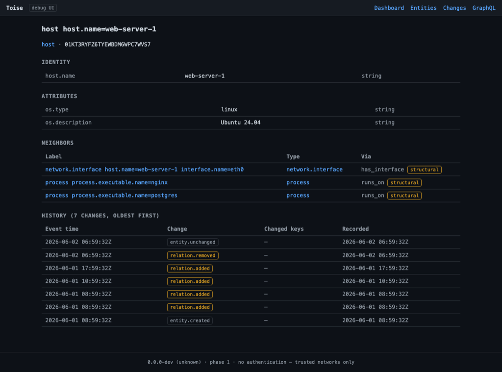

# Debug UI

A minimal, **zero-dependency** browser view for operators to eyeball the graph
without writing a query. It is served at the root of the HTTP listener:

```text
http://127.0.0.1:8080/
```

It reads the same in-memory projection and event log as
[GraphQL](graphql.md) and the [MCP server](mcp.md), so it always shows the same
world — it is a *view*, not a separate store.



## What it is for

- A quick visual check that ingestion is working and entities are arriving.
- Browsing entities, their identifying and descriptive attributes, and the
  relations incident to them.
- Following edges by hand to understand the topology.

It is intentionally minimal and read-only. For programmatic access use
[GraphQL](graphql.md); for natural-language questions use an assistant over
[MCP](mcp.md); for an interactive GraphQL session use the playground at
`http://127.0.0.1:8080/playground`.

!!! note "Human interfaces live at the edge"
    The debug UI is deliberately a thin operator aid, not the product. Toise's
    core is the engine and its query surfaces; rich human visualisation belongs
    at the edges
    ([ADR 0021](https://github.com/toise-dev/toise/blob/main/docs/architecture/adr/0021-human-interfaces-at-the-edge.md)).
    The
    [`graph-viz` example](https://github.com/toise-dev/toise/tree/main/examples)
    shows a live, GraphQL-subscriptions client rendering the graph in real time.
