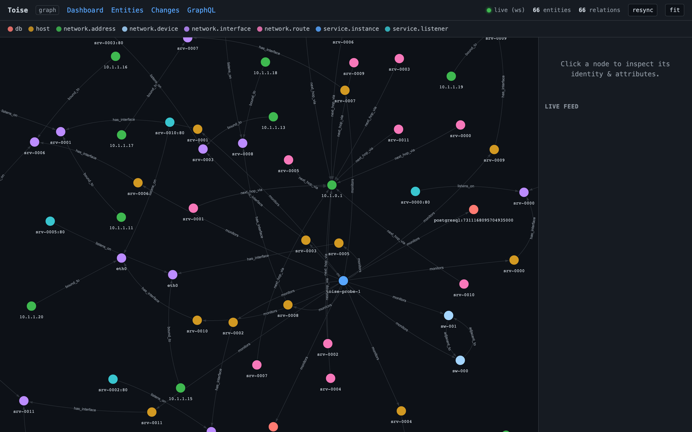

# graph-viz — live graph explorer

A small, dependency-free **example consumer** of the Toise GraphQL API: a
single static HTML page that draws the entity/relation graph and updates it in
real time.

> This is an **example client**, not part of `toise-server`. It talks to Toise
> only over the public GraphQL surface, exactly like any third-party consumer
> would. Nothing here is compiled into the server binary.



## What it shows

- A force-directed node-link graph (via [vis-network], loaded from a CDN with
  Subresource Integrity).
- Nodes coloured by entity `type`, with a clickable legend to filter types.
- Edges labelled by relation `type`, arrowed from source to target.
- A side panel with the selected entity's identity and attributes.
- A live feed of recent changes; nodes pulse as they update.

## How it works

1. **Initial load** — one GraphQL query for `entities` + `relations` populates
   the graph.
2. **Live updates** — it opens a WebSocket (`graphql-transport-ws`) and
   subscribes to `entityChanged` and `relationChanged`; each change event is
   applied incrementally.
3. **Resilience** — automatic reconnect with backoff; if the WebSocket can't be
   established it falls back to periodic polling (status pill shows
   `live (ws)` / `polling (ws off)` / `reconnecting…`).

All entity-supplied strings (identity values, attributes, type names) are
HTML-escaped before rendering.

## Running it

The page calls a **same-origin** `/graphql` by default, so the simplest setup is
to serve `index.html` behind the same reverse proxy that fronts `toise-server`
(so both `index.html` and `/graphql` — including the WebSocket upgrade — share an
origin). That is how it is wired in front of a real deployment.

To point it at a Toise instance on another origin, pass the endpoint explicitly:

```
index.html?api=https://my-toise.example.com/graphql
```

(Cross-origin use requires the server/proxy to allow it; same-origin needs no
extra configuration.)

Seed some data first if your instance is empty — e.g. run `toise-demo`, or point
an OpenTelemetry producer (such as `toise-probe`) at the server.

## Notes

- `toise-server` has no authentication by default; enable its native bearer-token
  auth and TLS (or put auth on a fronting proxy) if you expose this beyond a
  trusted network.
- Real-time updates rely on GraphQL subscriptions over WebSocket.

[vis-network]: https://visjs.github.io/vis-network/
